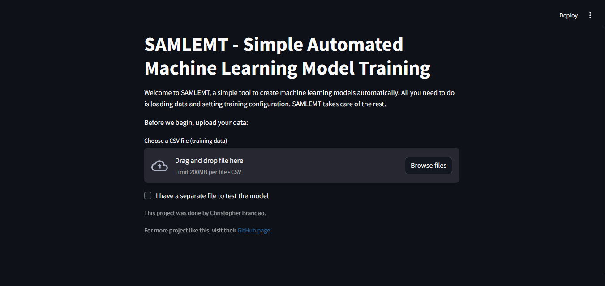
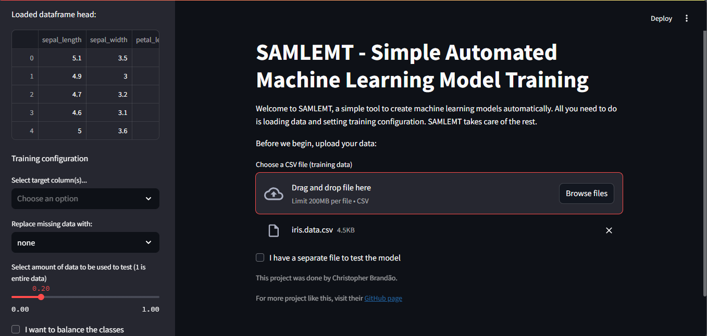
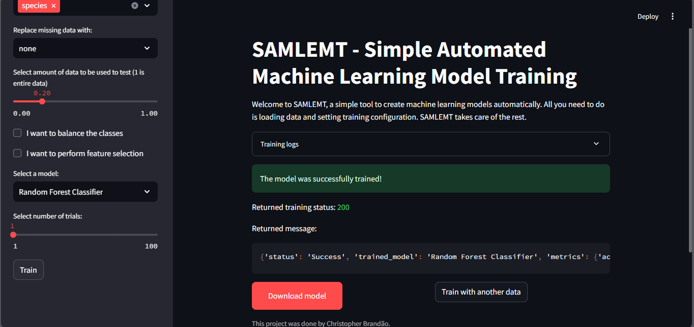
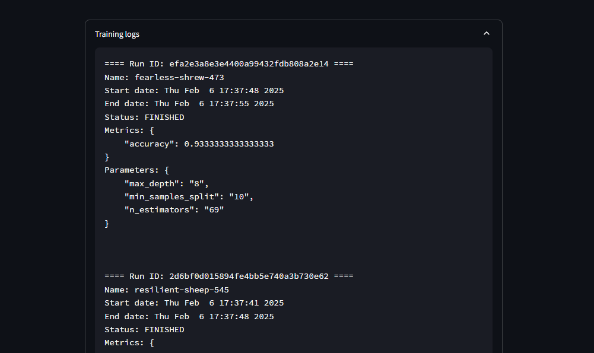

# SAMLEMT - Simple Automated Machine LEarning Model Training

A simple app which lets you train machine learning models and allows you to download models.

## Description

This application was made using Python libraries (especially `streamlt` for the front-end) and operates by taking CSV files as training data. It lets you configure the training process and execute it automatically. After finished training, you get access to the logs (created using `mlflow`) and you can download the model.

## Layout

The layout contains a file uploader which allows you to upload your data, which should be a CSV file. 

If you have a separate CSV file containing test data, you can enable another file uploader (this time to upload test data) by checking the box, which also shows up in the main page, as shown in the image above.

## Model training process

The app performs the basics steps of training a machine learning model, from data processing, feature selection, train-test split, model selection, hyperparameter optinisation and model evaluation. It can also deal with class imbalance and allows you to select which method you'd like to use to balance the labels in case you're training a classifier. \

To perform the hyperparameter tuning automatically, `optuna` was used. Both feature selection and class balancing can be removed from the training process in the configuration side bar, which also shows a preview of the uploaded data:

The model is trained through an API call, created with `FastAPI`. A POST request is sent, containing all required info to start the model training. When it stops, a response is sent back to the app, and is displayed on the screen.

## Results and logs

After finished training, the app returns the following screen, containing the logs, the training request response and the download button:

The logs contain information regarding model's performance according to evaluated metrics through time. It contains info regarding time of execution, status, parameters and measured metric, from each run of the model through `optuna`.

When you click on the download button, it'll generate a ZIP file containing the model and the steps performed to train it.

## Limitations and Next Steps

As it's a simplified AutoML-based app, there are still things to work on. For now it can only accept CSV files, so it's expected to add compatibility to more file types in the future. It also does not allow testing on the app, which is also expected to be added later. Also, more models, more class balancing techniques, and more API resources are resources to be added.
